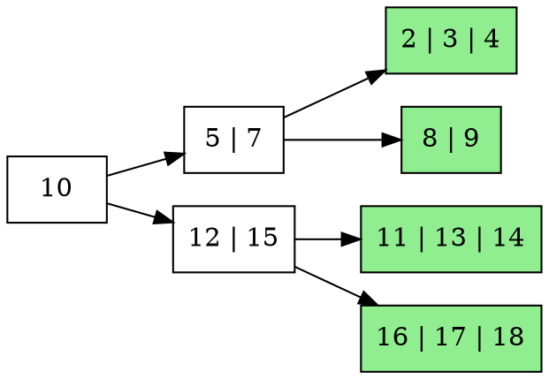
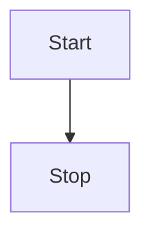

Trying some drawings.

![[index 2024-02-23 12.54.00.excalidraw.svg]]
%%[[index 2024-02-23 12.54.00.excalidraw.md|🖋 Edit in Excalidraw]]%%

```dot
digraph BPlusTree {
  rankdir=LR;
  node [shape=box];

  // Root node
  root [label="10"];

  // Level 1
  n1 [label="5 | 7"];
  n2 [label="12 | 15"];

  // Level 2 (leaf nodes in green)
  n3 [label="2 | 3 | 4" style=filled fillcolor=lightgreen];
  n4 [label="8 | 9" style=filled fillcolor=lightgreen];
  n5 [label="11 | 13 | 14" style=filled fillcolor=lightgreen];
  n6 [label="16 | 17 | 18" style=filled fillcolor=lightgreen];

  // Edges
  root -> n1;
  root -> n2;

  n1 -> n3;
  n1 -> n4;
  n2 -> n5;
  n2 -> n6;

  // Leaves (no outgoing edges)
  // no need to specify again, green style applied above
}
```

```mermaid
flowchart TD
    Start --> Stop
```